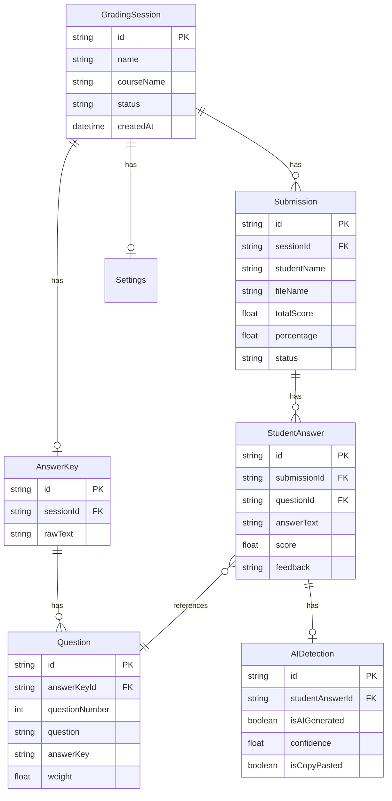

# 📚 GradeAssist - AI-Powered Automatic Grading System

> **Automated grading system for essay questions using AI (Gemini/OpenAI) with AI-generated content detection and plagiarism checking.**

GradeAssist is a modern web application that helps educators automatically grade student essay submissions using AI. It supports bulk grading, AI content detection, similarity analysis, and comprehensive grade reporting.

---

## ✨ Features

### 🎯 Core Features
- **📄 Answer Key Upload** - Upload PDF answer keys with automatic question extraction using AI
- **📤 Bulk Submission Upload** - Upload multiple student submissions (PDF) at once
- **🤖 AI-Powered Grading** - Automatic grading using Gemini or OpenAI with customizable strictness
- **🔍 AI Content Detection** - Detect AI-generated answers with confidence scoring
- **📊 Plagiarism Detection** - Similarity analysis between student submissions
- **⚖️ Flexible Grading Scale** - Customizable grading scale with letter grades (A-E)
- **📈 Real-time Progress Tracking** - Live grading progress with per-student status
- **📑 Comprehensive Reports** - Detailed feedback per question with scoring breakdown

### 📊 Analytics & Reporting
- **Dashboard** - Overview statistics with recent sessions and top performers
- **Grade Distribution** - Visual charts showing grade distribution and performance metrics
- **Excel Export** - Export results to Excel with color-coded headers and formatting
- **Student Detail View** - Individual student performance with per-question breakdown
- **AI Detection Warnings** - Flagged answers with AI confidence scores

### ⚙️ Advanced Configuration
- **Grading Strictness Levels** - Lenient, Moderate, or Strict grading
- **Custom Penalties** - Configurable penalties for AI-generated content and plagiarism
- **Question Weights** - Assign custom weights to each question
- **Multi-language Support** - Grade answers in Indonesian or English
- **AI Detection Threshold** - Adjustable confidence threshold for AI detection

---

## 🛠️ Tech Stack

### Frontend
- **[Next.js 15](https://nextjs.org/)** - React framework with App Router
- **[React 19](https://react.dev/)** - UI library
- **[TypeScript](https://www.typescriptlang.org/)** - Type safety
- **[TanStack Query](https://tanstack.com/query)** - Server state management with optimistic updates
- **[Zustand](https://zustand-demo.pmnd.rs/)** - Client state management
- **[Tailwind CSS](https://tailwindcss.com/)** - Utility-first CSS
- **[shadcn/ui](https://ui.shadcn.com/)** - Beautiful UI components
- **[Recharts](https://recharts.org/)** - Data visualization
- **[Lucide Icons](https://lucide.dev/)** - Icon library
- **[Sonner](https://sonner.emilkowal.ski/)** - Toast notifications

### Backend
- **[Next.js API Routes](https://nextjs.org/docs/app/building-your-application/routing/route-handlers)** - Serverless API endpoints
- **[Prisma](https://www.prisma.io/)** - Type-safe ORM
- **[PostgreSQL](https://www.postgresql.org/)** - Database (via Supabase)
- **[Supabase](https://supabase.com/)** - Backend as a Service

### AI & Document Processing
- **[Google Gemini API](https://ai.google.dev/)** - Primary AI provider for grading & extraction
- **[OpenAI API](https://openai.com/)** - Alternative AI provider
- **[pdf-parse](https://www.npmjs.com/package/pdf-parse)** - PDF text extraction
- **[ExcelJS](https://github.com/exceljs/exceljs)** - Excel file generation

### Development Tools
- **[ESLint](https://eslint.org/)** - Code linting
- **[Prettier](https://prettier.io/)** - Code formatting
- **[TypeScript](https://www.typescriptlang.org/)** - Static type checking

---

## 🚀 Getting Started

### Prerequisites
- **Node.js** 18+ and npm/yarn/pnpm
- **PostgreSQL database** (or Supabase account)
- **Gemini API Key** or **OpenAI API Key**

### 1. Clone the Repository
```bash
git clone https://github.com/yourusername/grade-assist.git
cd grade-assist
```

### 2. Install Dependencies
```bash
npm install
# or
yarn install
# or
pnpm install
```

### 3. Environment Variables
Create a `.env` file in the root directory:

```env
# Database (Supabase PostgreSQL)
DATABASE_URL="postgresql://postgres:[PASSWORD]@[HOST]:6543/postgres?pgbouncer=true"
DIRECT_URL="postgresql://postgres:[PASSWORD]@[HOST]:5432/postgres"

# AI Provider (choose one or both)
GEMINI_API_KEY="your-gemini-api-key"
OPENAI_API_KEY="your-openai-api-key"
```

**Get API Keys:**
- **Gemini API**: https://makersuite.google.com/app/apikey
- **OpenAI API**: https://platform.openai.com/api-keys
- **Supabase**: https://supabase.com/dashboard (create new project → Settings → Database)

### 4. Database Setup
```bash
# Generate Prisma Client
npx prisma generate

# Run database migrations
npx prisma migrate dev

# (Optional) Seed database with default settings
npx prisma db seed
```

### 5. Run Development Server
```bash
npm run dev
# or
yarn dev
# or
pnpm dev
```

Open [http://localhost:3000](http://localhost:3000) in your browser.

---

## 📖 Usage Guide

### Step-by-Step Grading Workflow

#### 1️⃣ Create a Grading Session
- Navigate to **Sessions** page
- Click **"+ Buat Sesi Baru"**
- Enter session name and course name
- Click **Create**

#### 2️⃣ Upload Answer Key
- Open the session
- Go to **"Kunci Jawaban"** tab
- Upload a PDF containing the answer key
- AI will automatically extract questions (10-30 seconds)
- Review and adjust question weights if needed

#### 3️⃣ Upload Student Submissions
- Go to **"Jawaban Mahasiswa"** tab
- Upload multiple student PDF submissions
- Files will be parsed automatically
- View uploaded submissions list

#### 4️⃣ Configure & Start Grading
- Go to **"Penilaian & Hasil"** tab
- Click **"Mulai Penilaian"**
- Configure grading settings:
  - **Strictness**: Lenient / Moderate / Strict
  - **AI Detection**: Enable/Disable
  - **Penalties**: AI penalty % and plagiarism penalty %
  - **Language**: Indonesian / English
- Click **"Mulai Penilaian"** to start
- Monitor real-time progress

#### 5️⃣ Review Results
- Once completed, view results in **"Nilai Akhir & Huruf Mutu"** tab
- See grade distribution, statistics, and top performers
- Click on individual students to see detailed feedback
- Export to Excel for further analysis

---

## 📂 Project Structure

```
grade-assist/
├── prisma/
│   ├── schema.prisma           # Database schema
│   └── migrations/             # Database migrations
├── src/
│   ├── app/                    # Next.js App Router
│   │   ├── api/               # API routes
│   │   │   ├── dashboard/    # Dashboard stats API
│   │   │   ├── sessions/     # Session management APIs
│   │   │   └── settings/     # Settings APIs
│   │   ├── sessions/         # Session pages
│   │   │   └── [sessionId]/ # Dynamic session routes
│   │   ├── settings/         # Settings page
│   │   ├── layout.tsx        # Root layout
│   │   └── page.tsx          # Dashboard page
│   ├── components/
│   │   ├── features/         # Feature-specific components
│   │   │   ├── dashboard/   # Dashboard components
│   │   │   ├── sessions/    # Session list components
│   │   │   └── session-detail/ # Session detail components
│   │   ├── shared/           # Shared components
│   │   └── ui/               # shadcn/ui components
│   ├── hooks/                # Custom React hooks
│   │   ├── useDebounce.ts
│   │   ├── useGradingPolling.ts
│   │   └── useWeightsManager.ts
│   ├── lib/                  # Utility libraries
│   │   ├── ai/              # AI provider implementations
│   │   ├── export/          # Excel/CSV exporters
│   │   ├── grading/         # Grading logic
│   │   ├── parsing/         # PDF parsing
│   │   ├── queries/         # TanStack Query hooks
│   │   ├── stores/          # Zustand stores
│   │   ├── api-client.ts    # API client wrapper
│   │   ├── prisma.ts        # Prisma client
│   │   └── utils.ts         # Utility functions
│   └── types/               # TypeScript type definitions
├── .env.example             # Environment variables template
├── next.config.ts          # Next.js configuration
├── tailwind.config.ts      # Tailwind CSS configuration
├── tsconfig.json          # TypeScript configuration
└── package.json           # Dependencies
```

---

## 🎨 Key Architecture Decisions

### State Management
- **TanStack Query** - Server state with automatic caching, polling, and optimistic updates
- **Zustand** - Lightweight client state for UI preferences
- **React Hooks** - Local component state for forms and UI interactions

### Performance Optimizations
- **React.memo** - Memoized list components to prevent unnecessary re-renders
- **useMemo** - Cached expensive computations (filtering, sorting)
- **useDebounce** - Debounced search inputs (300ms)
- **Optimistic Updates** - Instant UI feedback for delete operations
- **Code Splitting** - Lazy-loaded components with dynamic imports

### Data Fetching Strategy
- **Polling** - Real-time grading progress updates (3-second interval)
- **Stale-While-Revalidate** - Fresh data with background updates
- **Aggressive GC** - Immediate cleanup of unused queries

### Error Handling
- **Toast Notifications** - User-friendly error messages
- **Graceful Degradation** - Fallback UI for loading/error states
- **Transaction Rollback** - Atomic database operations with 30s timeout

---

## 🔒 Security Features

- **CSV Injection Prevention** - Escaped special characters in exports
- **SQL Injection Protection** - Prisma parameterized queries
- **Environment Variables** - Sensitive data stored in `.env`
- **API Key Validation** - Check API keys before grading
- **File Type Validation** - Only PDF files accepted
- **Rate Limiting** - Prevent abuse of AI APIs (built-in by providers)

---

## 🐛 Troubleshooting

### Database Connection Error (P1001)
```
Error: Can't reach database server
```
**Solution:**
- Check if PostgreSQL is running
- Verify `DATABASE_URL` in `.env`
- For Supabase: Check project status in dashboard
- Try using `DIRECT_URL` instead of `DATABASE_URL`

### AI API Errors
```
Error: Invalid API key
```
**Solution:**
- Verify API key in `.env`
- Check API key permissions
- Ensure billing is enabled (for OpenAI)

### Transaction Timeout
```
Error: Transaction already closed (P2028)
```
**Solution:**
- Already fixed! Transaction timeout increased to 30s
- If still happening, check database connection latency

### File Upload Errors
```
Error: Content-Type not multipart/form-data
```
**Solution:**
- Already fixed! FormData handling in API client
- Make sure you're using latest code

---

## 📊 Database Schema Overview



---

## 🤝 Contributing

Contributions are welcome! Please follow these steps:

1. Fork the repository
2. Create a feature branch (`git checkout -b feature/amazing-feature`)
3. Commit your changes (`git commit -m 'Add amazing feature'`)
4. Push to the branch (`git push origin feature/amazing-feature`)
5. Open a Pull Request

---

## 📝 License

This project is licensed under the MIT License - see the [LICENSE](LICENSE) file for details.

---

## 👨‍💻 Authors

- **Your Name** - *Initial work* - [YourGitHub](https://github.com/yourusername)

---

## 🙏 Acknowledgments

- **Anthropic Claude** - AI-assisted development
- **Vercel** - Deployment platform
- **Supabase** - Database hosting
- **shadcn/ui** - UI component library
- **TanStack** - Powerful React libraries

---

## 📞 Support

If you encounter any issues or have questions:
- **GitHub Issues**: [Create an issue](https://github.com/yourusername/grade-assist/issues)
- **Email**: your.email@example.com
- **Documentation**: [Wiki](https://github.com/yourusername/grade-assist/wiki)

---

## 🗺️ Roadmap

- [ ] Multi-choice question support
- [ ] Batch processing for large submissions
- [ ] WebSocket for real-time updates (replace polling)
- [ ] PDF annotation for feedback
- [ ] Student portal for viewing grades
- [ ] Integration with LMS (Canvas, Moodle)
- [ ] Mobile app (React Native)
- [ ] Advanced analytics with ML insights

---

**Made with ❤️ and AI assistance**
